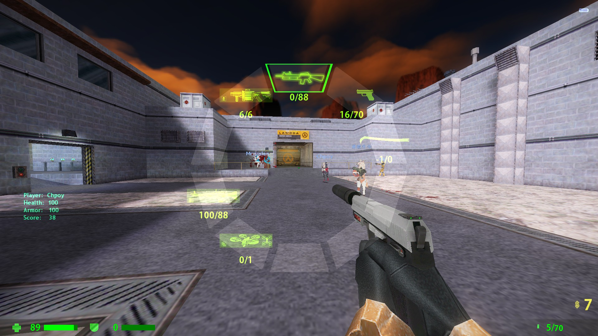
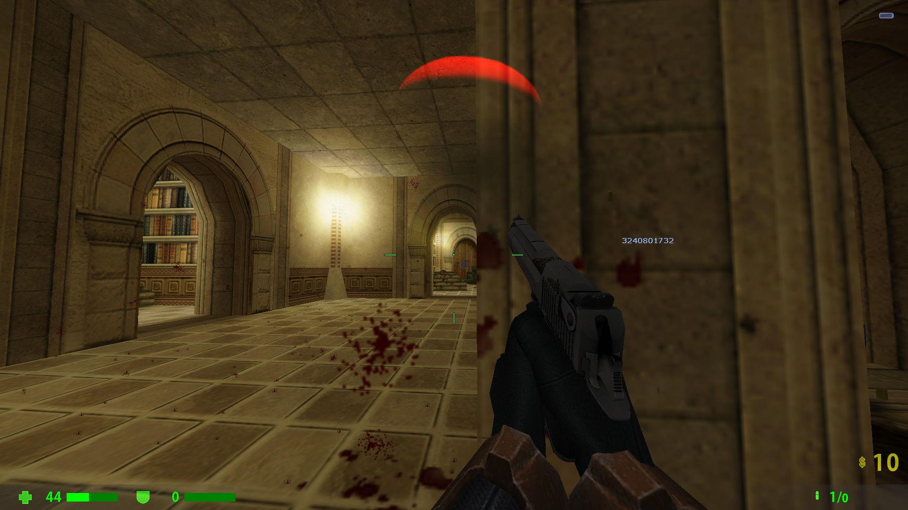

# ABCEnchance
ABCEnchance is a metabook plugin that provides experience improvement for Sven co-op

# **This plugin is under development and unstable, and may have major modifications compared with the current one**
# **USE AT YOUR OWN RISK**

# Known issue

 - After `CBasePlayer::RemovePlayerItem`, the menu will display the removed items incorrectly because there is no corresponding networkmessage to synchronize the message
 - Sometimes will empty the weapon menu incorrectly after player death
 - Dynamic indicator will point to wrong direction

# Install
 1. Download and install [MetahookSV](https://github.com/hzqst/MetaHookSv)
 2. Download Build directory, put  `abcenchance` into `svencoop` directory, put `ABCEnchance.dll` into `svencoop/metahook/plugins` directory.
 3. Open `svencoop/metahook/configs/plugins.lst`, add `ABCEnchance.dll` as a new line.
 4. Edit `svencoop/abcenchance/ABCEnchance.res` files as you like.
# CVars
|CVar|uses|default|range|
|---|---|---|---|
|cl_hud_csgo|Use now hud or not(restart map to take effect)|1|0/1|
|---|---|---|---|
|cl_radar|Radar|1|0/1|
|cl_radarzoom|Radar Zoom|2.5|0.0001~9999|
|cl_radarsize|Radar Size|344|0-9999|
|cl_radargap|Radar Gap|0.98|0-1|
|cl_radarupdateint|Radar image update interval|1|0-9999|
|---|---|---|---|
|cl_playertitle|Show Player name|1|0/1|
|---|---|---|---|
|cl_crosshair|Show dynamic crosshair|1|0/1|
|cl_crosshairautohide|Auto hide crosshair when zoomed|1|0/1|
|cl_crosshairsize|Size|24|0-999|
|cl_crosshairthickness|Thickness|2|0-999|
|cl_crosshairgap|Gap|16|0-999|
|cl_crosshairmultiple|punch angle feedback multipiler|3|0-999|
|cl_crosshairalpha|A|200|0-255|
|cl_crosshaircolor_r|R|50|0-255|
|cl_crosshaircolor_g|G|250|255|
|cl_crosshaircolor_b|B|50|50|
|cl_crosshair_outline_draw|Draw outline or not|1|0/1|
|cl_crosshair_outline|Outline thickness|1|0-999|
|cl_crosshair_t|T shape|0|0/1|
|cl_crosshairdot|Draw center dot or not|0|0/1|
|---|---|---|---|
|abc_bloodsprite_speed|Efx bloodsprite speed|128|0-9999|
|abc_bloodsprite_num|Efx new bloodsprite number|32|0-9999|
|abc_explosion_smokenumr|Efx explosion smoke number|32|0-9999|
|abc_explosion_smokespeed|Efx explosion smoke disapear speed|256|0-9999|
|abc_ricochet_sparknum|Efx ricochet spark number(Not implemented yet)|24|0-9999|
|---|---|---|---|
|cl_modellag|View model lag|1|0/1|
|cl_modellagvalue|View model lag value|1.0|0-9999|
|---|---|---|---|
|cam_idealheight|Change thirdperson camera height|0|-9999-9999|
|---|---|---|---|
|cl_curdebug|Curweapon Debug|0|0/1|

# Build
 1. clone or download [MetahookSV](https://github.com/hzqst/MetaHookSv)
 2. clone or download repository
 3. copy `ABCEnchance-master` into `MetaHookSv-master/Plugins`
 4. build `glew` or `glew-debug`
 5. build repository
# CSGO like Hud and dsplaying player name title

# Annular selection menu

## And fixed the problem that the svencoop selection menu could not switch Postion conflict weapons

# Dynamic indicator and dynamic crosshair

# Radar

# And some useless efx enchance

