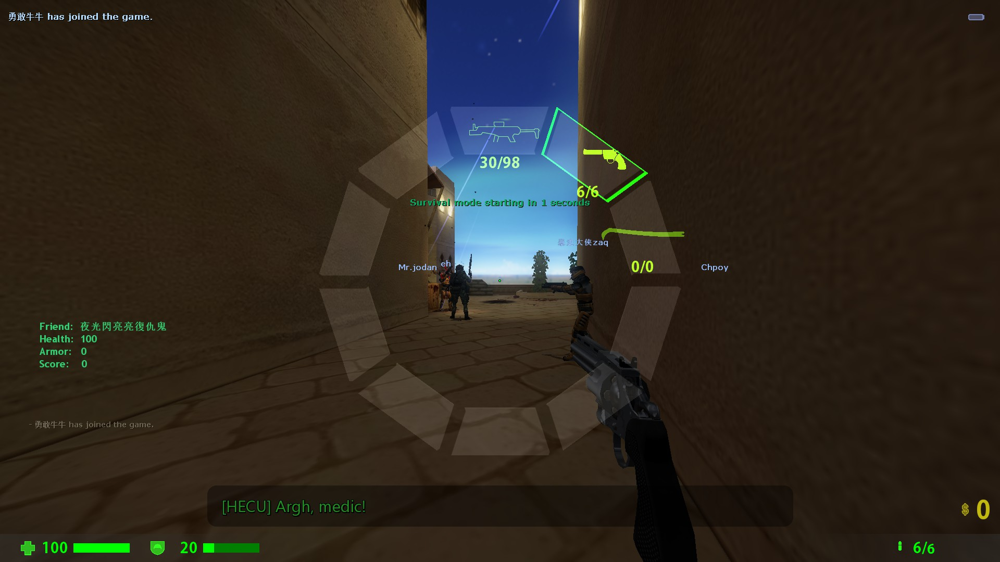

# ABCEnchance
ABCEnchance is a metabook plugin that provides experience improvement for Sven co-op

# **This plugin is under development and unstable, and may have major modifications compared with the current one**
# **USE AT YOUR OWN RISK**

# Known issue

 - After `CBasePlayer::RemovePlayerItem`, the menu will display the removed items incorrectly because there is no corresponding networkmessage to synchronize the message
 - Sometimes will empty the weapon menu incorrectly after player death
 - Dynamic indicator will point to wrong direction

# CSGO like Hud and dsplaying player name title

# Annular selection menu

## And fixed the problem that the svencoop selection menu could not switch Postion conflict weapons

# Dynamic indicator and dynamic crosshair

# Radar

# And some useless efx enchance

