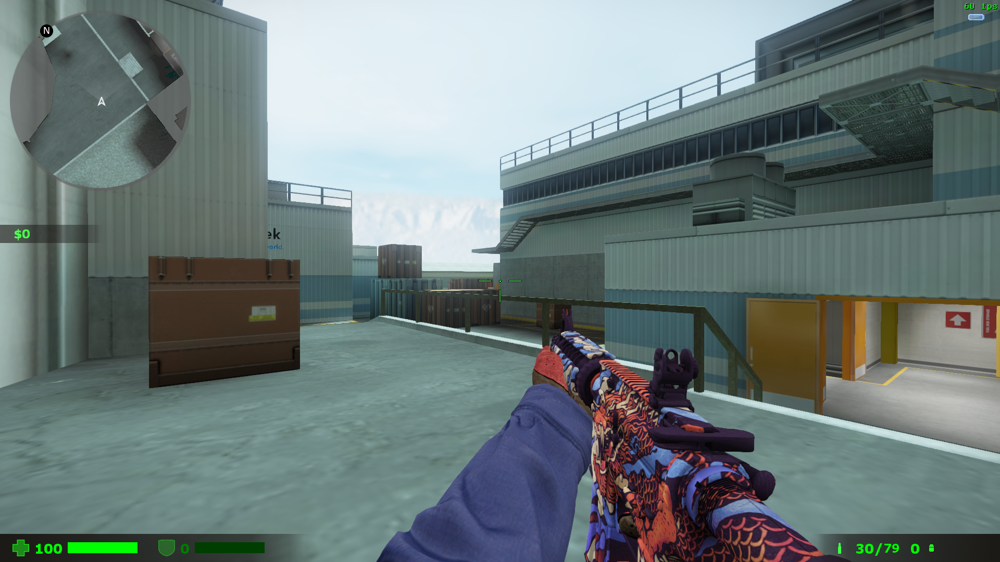
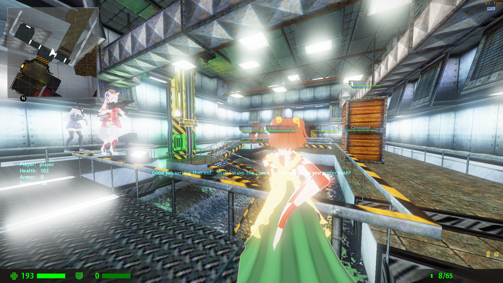
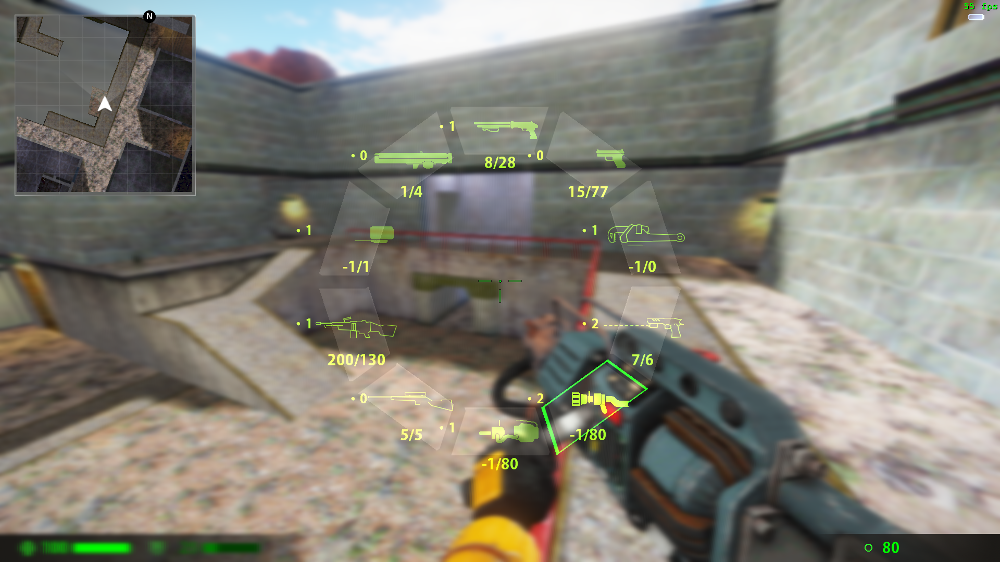

# 🔤 **ABCEnchance**

###  ABCEnchance is a metahook plugin that provides experience improvement for Sven co-op

----

# ⚠️ **This plugin is under development and unstable, and may have major modifications compared with the current one** ⚠️
# 💥 **USE AT YOUR OWN RISK** 💥

----

# 🀄 中文README

> ## &emsp;👉  <u>[点我](READMECN.md)</u>

# 🤫 Known issue

 - [x] ~~After `CBasePlayer::RemovePlayerItem`, the menu will display the removed items incorrectly because there is no corresponding networkmessage to synchronize the message~~
 - [x] ~~Sometimes will empty the weapon menu incorrectly after player death~~
 - [x] ~~Dynamic indicator will point to wrong direction~~
 - [ ] The number of bullets in the second weapon will not be displayed correctly in Akimbo uzi. it is seem not regular `iAmmoType2`?
 - [ ] Weapon postion conflict fix will not work
 - [x] ~~when bind `+annularmenu` command to `mouse4` or `mouse5`, `-annularmenu` command will not execute automatically.~~

# 🖥️ Install
 1. Download and install [MetahookSV](https://github.com/hzqst/MetaHookSv)
 2. Download Build directory, put  `abcenchance` into `svencoop` directory, put `ABCEnchance.dll` into `svencoop/metahook/plugins` directory.
 3. Open `svencoop/metahook/configs/plugins.lst`, add `ABCEnchance.dll` as a new line.
 4. Edit `svencoop/abcenchance/ABCEnchance.res` files as you like.

# 🏗️ Build
 1. clone or download [MetahookSV](https://github.com/hzqst/MetaHookSv)
 2. clone or download repository
 3. copy `ABCEnchance-master` into `MetaHookSv-master/Plugins`
 4. build `glew` or `glew-debug`
 5. build repository
 
 ----

# 📤 Command
|Command|usage|
|----|----|
|+annularmenu|Open cycler weapon menu(Mouse selection)|
|-annularmenu|Close cycler weapon menu(Mouse selection)|
|+scaleradar|Start scale radar size|
|-scaleradar|Stop scale radar size|
# 📊 CVars
|CVar|uses|default|range|
|---|---|---|---|
|cl_hud_csgo|Use now hud or not(restart map to take effect)|1|0/1|
|---|---|---|---|
|hud_deathnotice_time|the death message keep time|6|0~9999|
|---|---|---|---|
|cl_customslot1|Set customslot 1| |weapon_xxxxx|
|cl_customslot2|Set customslot 2| |weapon_xxxxx|
|cl_customslot3|Set customslot 3| |weapon_xxxxx|
|cl_customslot4|Set customslot 4| |weapon_xxxxx|
|cl_customslot5|Set customslot 5| |weapon_xxxxx|
|cl_customslot6|Set customslot 6| |weapon_xxxxx|
|cl_customslot7|Set customslot 7| |weapon_xxxxx|
|cl_customslot8|Set customslot 8| |weapon_xxxxx|
|cl_customslot9|Set customslot 9| |weapon_xxxxx|
|cl_customslot10|Set customslot 10| |weapon_xxxxx|
|cl_menudrawpos|Draw weapon Pos|0|0/1|
|cl_rainbowmenu|Draw weapon menu in rainbow|1|0/1/2|
|---|---|---|---|
|cl_radar|Radar|1|0/1/2|
|cl_radarzoom|Radar Zoom|2.5|0.0001~9999|
|cl_radarsize|Radar Size|344|0-9999|
|cl_radarsizetime|Radar Scale animation time|0.25|0~9999|
|cl_radargap|Radar Gap|0.98|0-1|
|cl_radarupdateint|Radar image update interval|1|0-9999|
|---|---|---|---|
|cl_playertitle|Show Player name|1|0/1/2|
|cl_playertitleheight|Player name bar height|48|0~9999|
|cl_playertitlelength|Player name bar length|196|0~9999|
|---|---|---|---|
|cl_crosshair|Show dynamic crosshair|1|0/1|
|cl_crosshairautohide|Auto hide crosshair when zoomed|1|0/1|
|cl_crosshairsize|Size|24|0-999|
|cl_crosshairthickness|Thickness|2|0-999|
|cl_crosshairgap|Gap|16|0-999|
|cl_crosshairmultiple|punch angle feedback multipiler|3|0-999|
|cl_crosshairalpha|A|200|0-255|
|cl_crosshaircolor_r|R|50|0-255|
|cl_crosshaircolor_g|G|250|255|
|cl_crosshaircolor_b|B|50|50|
|cl_crosshair_outline_draw|Draw outline or not|1|0/1|
|cl_crosshair_outline|Outline thickness|1|0-999|
|cl_crosshair_t|T shape|0|0/1|
|cl_crosshairdot|Draw center dot or not|0|0/1|
|---|---|---|---|
|abc_bloodsprite_speed|Efx bloodsprite speed|128|0-9999|
|abc_bloodsprite_num|Efx new bloodsprite number|32|0-9999|
|abc_explosion_smokenumr|Efx explosion smoke number|32|0-9999|
|abc_explosion_smokespeed|Efx explosion smoke disapear speed|256|0-9999|
|abc_ricochet_sparknum|Efx ricochet spark number(Not implemented yet)|24|0-9999|
|---|---|---|---|
|cl_modellag|View model lag|1|0/1|
|cl_modellagvalue|View model lag value|1.0|0-9999|
|---|---|---|---|
|cam_idealheight|Change thirdperson camera height|0|-9999-9999|
|---|---|---|---|
|cl_curdebug|Curweapon Debug|0|0/1|

----

# 🖼️ Images

### 🛑 <u>These pictures contain old version images, which may be inconsistent with the actual version</u> 🛑

## 👮 CSGO like Hud

## 🗿 Player name title and hp/ap bar

## 🏐 Annular selection menu

### ~~And fixed the problem that the svencoop selection menu could not switch Postion conflict weapons~~

## 🔺 Dynamic indicator and dynamic crosshair

## 🗺️ Radar

## 🗳️ The voting menu that won't block you when you bunnyhopping

## 💀 Player death message

## 😗 And some useless efx enchance

