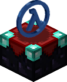
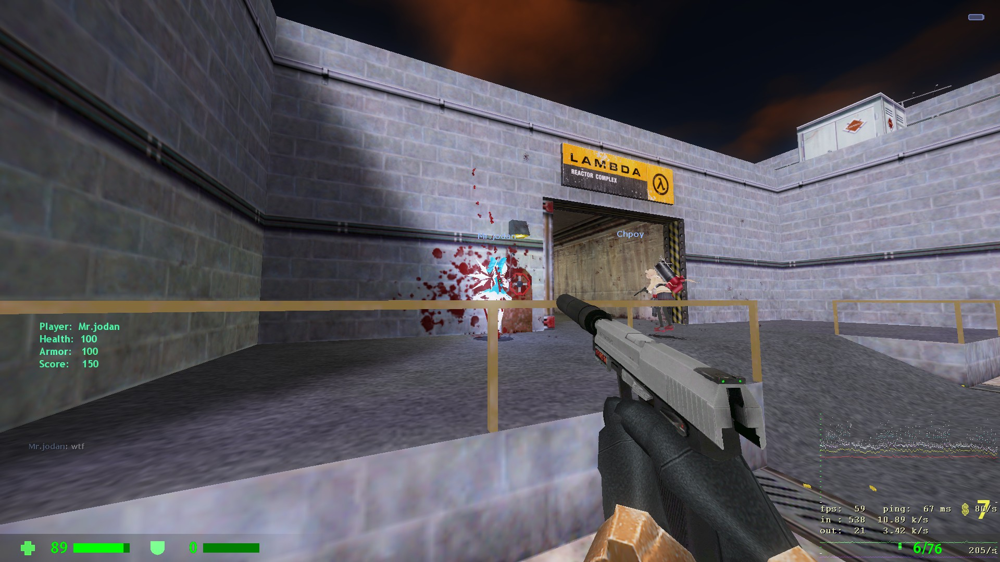
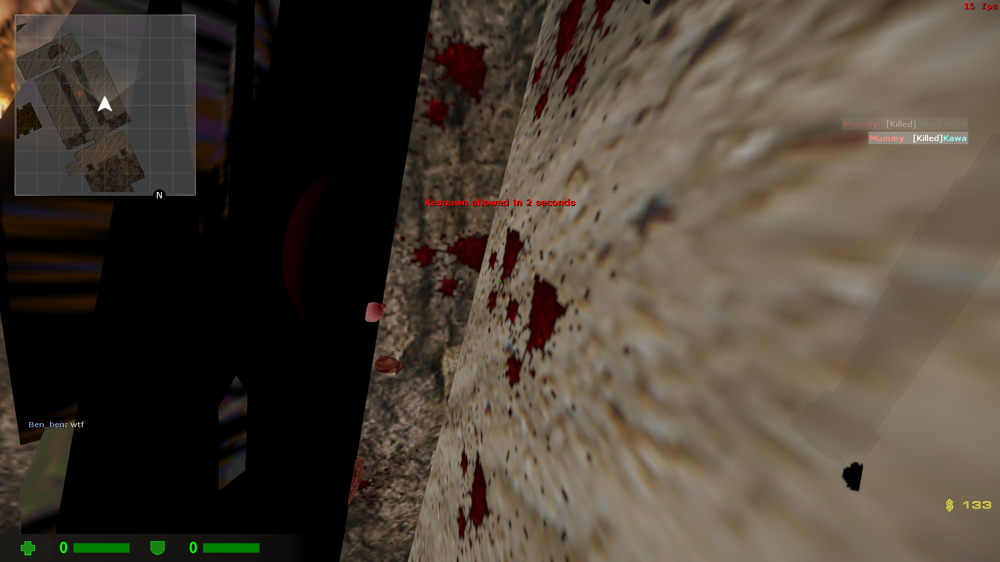
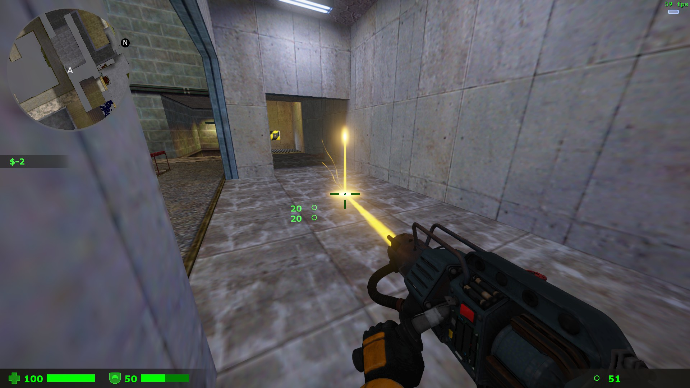

# ABCEnchance

A MetaHookSV plugin that introduces more instability and possible enhancements to the Sven Co-op.

"Enchance" means "Enchantment", look the icon 👉

<!-- badges: start -->


<!-- badges: end -->


----

# ⚠️ **<span color="#dd0000">This plugin introduces more potential risks of instability to the game. and, due to ongoing development, may have a large difference between the screenshots and real plugin</span>** ⚠️
# 💥 **<span color="#dd0000">USE AT YOUR OWN RISK</span>** 💥

----

# 🀄 <u>[点我获得中文！](READMECN.md)</u>

# 🖥️ Install
 1. Download and install [MetahookSV](https://github.com/hzqst/MetaHookSv)
 2. Install
    
    Automatic:

    1. Double Click `ABCEnchanceInstaller.exe`，then run game
   
    2. Edit `svencoop/abcenchance/ABCEnchance.res` files as you like.

    Manual:

    3. Download Build directory, put `svencoop` and `svencoop_addon` directory into game root. The results will be as follows:
   
    ```
        Sven Coop
        ├─svencoop
        │  ├─abcenchance
        │  │  ├─localize
        │  │  ├─mdl
        │  │  ├─shader
        │  │  ├─spr
        │  │  ├─tga
        │  │  ├─....
        │  │  ABCEnchance.res
        │  └─metahook
        │     └─plugins
        │       └─ABCEnchance.dll
        ├─svencoop_addon
        │  └─resource
        │     └─.....
        svencoop.exe
    ```

    4. Open `svencoop/metahook/configs/plugins.lst`, add `ABCEnchance.dll` as a new line. Please load the plugin before CaptionMod.

    5. Edit the res file in `svencoop/abcenchance/` to your liking.

# 🏗️ Build

 1. clone this with `--recursive`

 ```
 git clone --recursive https://github.com/DrAbcOfficial/ABCEnchance
 ```

2. Build with MSVC
 
 ----

# 📤 Command
|Command|usage|
|----|----|
|+scaleradar|Start scaling radar|
|-scaleradar|Stop scaling radar|
|+ducktap|Start ducktap|
|-ducktap|Stop ducktap|
|models|search player models|
|concurrent|add concurrent cmd|
|removeconcurrent|remove concurrent cmd|
|events|add or remove event cmd|
# 📊 CVars
|CVar|uses|default|range|
|---|---|---|---|
|hud_dynamic_background|use dynamic background|1|0/1|
|---|---|---|---|
|cl_autojump|enable auto bhop|0|0/1|
|---|---|---|---|
|hud_deathnotice|use new death message|1|0~1|
|hud_deathnotice_time|the death message keep time|6|0~9999|
|---|---|---|---|
|hud_rainbow_menu|Draw weapon menu in rainbow|0|0/1/2|
|---|---|---|---|
|hud_highlight_item|Draw item high light|1|0/1|
|hud_highlight_item_range|Item high light range|344|0~500|
|---|---|---|---|
|hud_danger_health|Danger health value|45|0~9999|
|hud_danger_armor|Danger armor value|45|0~9999|
|hud_damageshock|Enable shock pain indicator|0|0/1|
|hud_damageshock_factor|shock pain indicator strong|0.015|0~99999|
|hud_damageshock_base|min damage to show shock pain indicator|30|0~99999|
|---|---|---|---|
|hud_radar|Radar|1|0/1/2|
|hud_radarzoom|Radar Zoom|2.5|0.0001~9999|
|hud_radarupdateint|Radar image update interval|1|0-9999|
|---|---|---|---|
|hud_playerinfo|Show Player name|1|0/1/2|
|hud_playerinfo_danger|Set danger health|30|any shit|
|---|---|---|---|
|cl_crosshair|Show dynamic crosshair|1|0/1|
|cl_crosshairautohide|Auto hide crosshair when zoomed|1|0/1|
|cl_crosshairsize|Size|24|0-999|
|cl_crosshairthickness|Thickness|2|0-999|
|cl_crosshairgap|Gap|16|0-999|
|cl_crosshairmultiple|punch angle feedback multipiler|3|0-999|
|cl_crosshairalpha|A|200|0-255|
|cl_crosshaircolor_r|R|50|0-255|
|cl_crosshaircolor_g|G|250|255|
|cl_crosshaircolor_b|B|50|50|
|cl_crosshair_outline_draw|Draw outline or not|1|0/1|
|cl_crosshair_outline|Outline thickness|1|0-999|
|cl_crosshair_t|T shape|0|0/1|
|cl_crosshairdot|Draw center dot or not|0|0/1|
|cl_crosshair_anim_time|Dynamic interval duration|0.1|0-1|
|---|---|---|---|
|abc_bloodefx|Enable blood efx|1|0/1|
|abc_bloodsprite_speed|Efx bloodsprite speed|128|0-9999|
|abc_bloodsprite_num|Efx new bloodsprite number|32|0-9999|
|abc_gaussefx|Enable gauss efx|1|0/1|
|---|---|---|---|
|hud_sideinfo|Enable side text panel for speed, score, etc.|1|0/1|
|cl_eccomenu|Enable Ecco buymenu enhance|1|0/1|
|---|---|---|---|
|cl_modellag|View model lag|1|0/1|
|cl_modellag_value|View model lag value|1.0|0-9999|
|cl_modelslide|View model rotate when crouch|1|0/1|
|cl_modelslide_length|View model rotate left offset|12|0-9999|
|cl_modelslide_height|View model rotate down offset|12|0-9999|
|cl_modelslide_angle|View model rotate degree|24|0-360|
|---|---|---|---|
|cam_idealheight|Change thirdperson camera height|0|-9999-9999|
|cam_idealright|Change thirdperson camera right|0|-9999-9999|
|---|---|---|---|
|hud_scoreboard_xxxxx|scoreboard thing|xxx|xxx|
|hud_motd|-1 close Motd, 0 vanillia motd, 1 new motd|1|0


# 🍕 Concurrent cmd and Event cmd

Concurrent cmd are those that accompany the execution of a new cmd after the execution of a particular cmd is complete, columns such as
``
concurrent say "kill"
```
When set, kill will be executed after every say cmd the player executes.

Event commands are commands that start executing when a specific client-side event is triggered.
Event commands can have up to four parameters passed in, which can be used as placeholders in the form of param1 ~ param4.

The following is an example of an event directive
```
events 1 death "say I bleed all over the place!"
``
will send a message when the player dies
```
events 1 damage "say I took {param1} damage!"
```
will send a message when the player is injured, the placeholders in the message will be replaced when it is sent

|event|description|param1|param2|param3|param4|
|---|---|---|---|---|---|
|death|Player death|||||
|damage|Player Injury|Damage Values|Armour Values|Damage Type ||
|health|life change|life value||||
|battery|Armour Value Change|Armour Value ||||
|flash_battery|Battery value change|Battery value ||||
|add_weapon|pick up weapon|weapon name ||||
|drop_weapon|Lose Weapon|Weapon Name ||||

----

# 🖼️ Images

### 🛑 <u>These pictures contain old version images, which may be inconsistent with the actual version</u> 🛑

|👮 CSGO like Hud|🗿 Player name title and hp/ap bar|
|--|--|
|<div></div>||

|🛒 Enhanced Ecco buy menu|🔺 Dynamic indicator and dynamic crosshair|
|--|--|
||<div></div>|

|🗺️ Radar|🗳️ Voting menus that don't come out and gross you out when you're bunnyhopping|
|--|--|
|<div></div>||

|💀 Player death message|☢️ BMS style gauss laser|
|--|--|
|||

|🪔 Item high light|😗 And some useless efx enchance|
|--|--|
|||

# Acknowledgements:

This repository uses code from the following repositories:

1. [PrimeXT](https://github.com/SNMetamorph/PrimeXT)
2. [BugfixedHL-Rebased](https://github.com/tmp64/BugfixedHL-Rebased)
3. [OpenAG](https://github.com/YaLTeR/OpenAG)
4. [CaptionMod](https://github.com/hzqst/CaptionMod)
5. [CKF3](https://github.com/CKFDevPowered/CKF3Alpha)
6. [hl1_source_sdk](https://github.com/tmp64/hl1_source_sdk)
8. [qrgen](https://www.nayuki.io/page/qr-code-generator-library)
