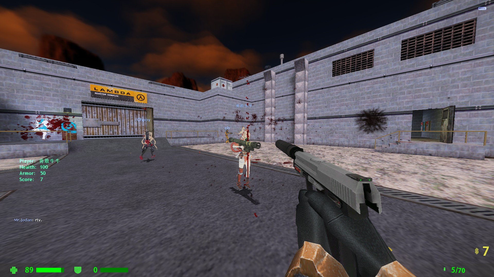

# ABCEnchance

A MetaHookSV plugin that introduces more instability and possible enhancements to the Sven Co-op.

"Enchance" means "Enchantment", look the icon 👉

<!-- badges: start -->


<!-- badges: end -->


----

# ⚠️ **<span color="#dd0000">This plugin introduces more potential risks of instability to the game. and, due to ongoing development, may have a large difference between the screenshots and real plugin</span>** ⚠️
# 💥 **<span color="#dd0000">USE AT YOUR OWN RISK</span>** 💥

----

# 🀄 <u>[点我获得中文！](READMECN.md)</u>

# 🖥️ Install
 1. Download and install [MetahookSV](https://github.com/hzqst/MetaHookSv)
 2. Install
    
    Automatic:

    1. Run `install-ABCEnchance.ps1` in PowerShell
   
    2. Edit `svencoop/abcenchance/ABCEnchance.res` files as you like.

    Manual:

    1. Download Build directory, put  `abcenchance` into `svencoop` directory, put `ABCEnchance.dll` into `svencoop/metahook/plugins` directory. The results will be as follows.
   
    ```
        Sven Coop
        ├─svencoop
        │  ├─abcenchance
        │  │  ├─localize
        │  │  ├─mdl
        │  │  ├─shader
        │  │  ├─spr
        │  │  ├─tga
        │  │  ABCEnchance.res
        │  └─metahook
        │     └─plugins
        │        └─ABCEnchance.dll       
        svencoop.exe

    ```

    2. Open `svencoop/metahook/configs/plugins.lst`, add `ABCEnchance.dll` as a new line. Please load the plugin before CaptionMod.

    3. Edit the res file in `svencoop/abcenchance/` to your liking.

# 🏗️ Build
 1. clone or download [MetahookSV](https://github.com/hzqst/MetaHookSv)
   
 2. clone or download repository
   
 3. copy `ABCEnchance-master` into `MetaHookSv-master/Plugins`

    Automatic:

    1. Run `build-ABCEnchance.ps1` in PowerShell
   
    Manual:

    1. build `glew` or `glew-debug`
   
    2. build repository
 
 ----

# 📤 Command
|Command|usage|
|----|----|
|+scaleradar|Start scale radar size|
|-scaleradar|Stop scale radar size|
|models|search player models|
# 📊 CVars
|CVar|uses|default|range|
|---|---|---|---|
|cl_hud_csgo|enable hud or not|1|0/1|
|---|---|---|---|
|hud_deathnotice|use new death message|1|0~1|
|hud_deathnotice_time|the death message keep time|6|0~9999|
|---|---|---|---|
|cl_menudrawpos|Draw weapon Pos|0|0/1|
|cl_rainbowmenu|Draw weapon menu in rainbow|0|0/1/2|
|---|---|---|---|
|cl_itemhighlight|Draw item high light|1|0/1|
|cl_itemhighlightrange|Item high light range|344|0~500|
|---|---|---|---|
|cl_hud_healthammo_style|Hide health and armor bar|0|0/1|
|cl_dangerhealth|Danger health value|45|0~9999|
|cl_dangerarmor|Danger armor value|45|0~9999|
|cl_damageshock|Enable shock pain indicator|0|0/1|
|cl_damageshock_factor|shock pain indicator strong|0.015|0~99999|
|cl_damageshock_base|min damage to show shock pain indicator|30|0~99999|
|---|---|---|---|
|cl_radar|Radar|1|0/1/2|
|cl_radarzoom|Radar Zoom|2.5|0.0001~9999|
|cl_radarsize|Radar Size|344|0-9999|
|cl_radarsizetime|Radar Scale animation time|0.25|0~9999|
|cl_radargap|Radar Gap|0.98|0-1|
|cl_radarupdateint|Radar image update interval|1|0-9999|
|---|---|---|---|
|cl_playertitle|Show Player name|1|0/1/2|
|cl_playertitle_danger|Set danger health|30|any shit|
|---|---|---|---|
|cl_crosshair|Show dynamic crosshair|1|0/1|
|cl_crosshairautohide|Auto hide crosshair when zoomed|1|0/1|
|cl_crosshairsize|Size|24|0-999|
|cl_crosshairthickness|Thickness|2|0-999|
|cl_crosshairgap|Gap|16|0-999|
|cl_crosshairmultiple|punch angle feedback multipiler|3|0-999|
|cl_crosshairalpha|A|200|0-255|
|cl_crosshaircolor_r|R|50|0-255|
|cl_crosshaircolor_g|G|250|255|
|cl_crosshaircolor_b|B|50|50|
|cl_crosshair_outline_draw|Draw outline or not|1|0/1|
|cl_crosshair_outline|Outline thickness|1|0-999|
|cl_crosshair_t|T shape|0|0/1|
|cl_crosshairdot|Draw center dot or not|0|0/1|
|---|---|---|---|
|abc_bloodefx|Enable blood efx|1|0/1|
|abc_bloodsprite_speed|Efx bloodsprite speed|128|0-9999|
|abc_bloodsprite_num|Efx new bloodsprite number|32|0-9999|
|abc_gaussefx|Enable gauss efx|1|0/1|
|---|---|---|---|
|cl_eccoenable|Enable Ecco show|1|0(off)/1(always show)/2(only detected Ecco plugin)|
|cl_eccocheck|Enable Ecco plugin check|0|0/1|
|cl_eccomenu|Enable Ecco buymenu enhance|1|0/1|
|---|---|---|---|
|cl_modellag|View model lag|1|0/1|
|cl_modellag_value|View model lag value|1.0|0-9999|
|cl_modelslide|View model rotate when crouch|1|0/1|
|cl_modelslide_length|View model rotate left offset|12|0-9999|
|cl_modelslide_height|View model rotate down offset|12|0-9999|
|cl_modelslide_angle|View model rotate degree|24|0-360|
|---|---|---|---|
|cam_idealheight|Change thirdperson camera height|0|-9999-9999|
|cam_idealright|Change thirdperson camera right|0|-9999-9999|
|---|---|---|---|
|cl_curdebug|Curweapon Debug|0|0/1|

----

# 🖼️ Images

### 🛑 <u>These pictures contain old version images, which may be inconsistent with the actual version</u> 🛑

|👮 CSGO like Hud|🗿 Player name title and hp/ap bar|
|--|--|
|<div></div>||

|🛒 Enhanced Ecco buy menu|🔺 Dynamic indicator and dynamic crosshair|
|--|--|
||<div></div>|

|🗺️ Radar|🗳️ Voting menus that don't come out and gross you out when you're bunnyhopping|
|--|--|
|<div></div>||

|💀 Player death message|☢️ BMS style gauss laser|
|--|--|
|||

|🪔 Item high light|😗 And some useless efx enchance|
|--|--|
|||