# ABCEnchance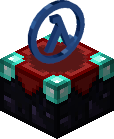

一个为Sven Co-op带来潜在的不稳定因素和可能的增强的MetaHookSV插件

"Enchance" 是指 "Enchantment", 你看这个图标 👉

<!-- badges: start -->


<!-- badges: end -->

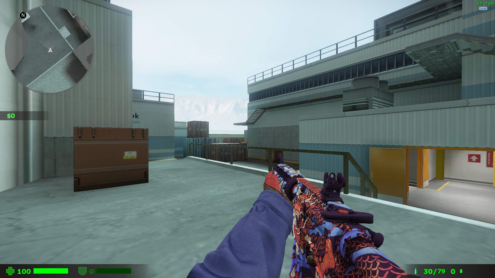

----

# ⚠️ **<span color="#dd0000">插件为游戏引入了潜在崩溃的风险，由于不断的开发可能与截图有异</span>** ⚠️
# 💥 **<span color="#dd0000">风险自负</span>** 💥

----

# 🖥️ 安装
 1. 下载并按指示安装 [MetahookSV](https://github.com/hzqst/MetaHookSv)

 2. 安装
    
    自动脚本:

    1. 在 PowerShell中运行 `install-ABCEnchance.ps1`
   
    2. 按你的喜好随便编辑 `svencoop/abcenchance/` 里的res文件.

    手动:

    1. 从release或者action下载压缩包，解压到 `svencoop`文件夹里, 再把dll文件移动到`svencoop/metahook/plugins`，最终看起来像是这样👇
   
    ```
        Sven Coop
        ├─svencoop
        │  ├─abcenchance
        │  │  ├─localize
        │  │  ├─mdl
        │  │  ├─shader
        │  │  ├─spr
        │  │  ├─tga
        │  │  ABCEnchance.res
        │  └─metahook
        │     └─plugins
        │        └─ABCEnchance.dll       
        svencoop.exe

    ```

    2. 打开 `svencoop/metahook/configs/plugins.lst`, 在CaptionMod前另起一行加上 `ABCEnchance.dll` .

    3. 按你的喜好随便编辑 `svencoop/abcenchance/` 里的res文件.

# 🏗️ 构建
 1. 克隆 [MetahookSV](https://github.com/hzqst/MetaHookSv)
   
 2. 克隆储存库到 `MetaHookSv-master/Plugins`
   
 3. 构建

    自动构建:

    1. 用powershell中运行 `build-ABCEnchance.ps1`
   
    手动:

    1. 按metahooksv里的指示构建 `glew` 或 `glew-debug`
   
    2. 打开sln按f5
 
 ----

# 📤 指令
|指令|作用|
|----|----|
|+scaleradar|开始放大雷达地图|
|-scaleradar|停止放大雷达地图|
|models|查找人物模型|
# 📊 CVars
|CVar|作用|默认值|取值范围|
|---|---|---|---|
|cl_hud_csgo|启用HUD|1|0/1|
|---|---|---|---|
|cl_menudrawpos|是否绘制武器Pos|0|0/1|
|cl_rainbowmenu|绘制武器菜单彩虹圈|0|0/1/2|
|---|---|---|---|
|cl_itemhighlight|是否显示物品高亮|1|0/1|
|cl_itemhighlightrange|物品高亮范围|344|0~500|
|---|---|---|---|
|cl_hud_healthammo_style|隐藏血条护甲条|0|0/1|
|cl_dangerhealth|濒死生命值|45|0~9999|
|cl_dangerarmor|濒死护甲值|45|0~9999|
|cl_damageshock|启用受伤色差|0|0/1|
|cl_damageshock_factor|受伤色差强度|0.015|0~99999|
|cl_damageshock_base|出现色差应受伤害|30|0~99999|
|---|---|---|---|
|hud_deathnotice|用新的死亡提示|1|0~1|
|hud_deathnotice_time|死亡提示保持时间|6|0~9999|
|---|---|---|---|
|cl_radar|启用雷达|2|0/1/2|
|cl_radarzoom|雷达缩放倍数|2.5|0.0001~9999|
|cl_radarsize|雷达绘制尺寸|344|0-9999|
|cl_radarsizetime|雷达放大动画时间|0.25|0~9999|
|cl_radargap|雷达大小|0.98|0-1|
|cl_radarupdateint|雷达更新频率（秒）|1|0-9999|
|---|---|---|---|
|cl_playertitle|展示玩家状态栏|1|0/1/2|
|cl_playertitle_danger|危险血量|30|啥都行|
|---|---|---|---|
|cl_crosshair|绘制动态准心|1|0/1|
|cl_crosshairautohide|开镜自动隐藏动态准心|1|0/1|
|cl_crosshairsize|尺寸|24|0-999|
|cl_crosshairthickness|粗细|2|0-999|
|cl_crosshairgap|距中心点间隔|16|0-999|
|cl_crosshairmultiple|后坐力扩散倍数|3|0-999|
|cl_crosshairalpha|透明度|200|0-255|
|cl_crosshaircolor_r|R|50|0-255|
|cl_crosshaircolor_g|G|250|255|
|cl_crosshaircolor_b|B|50|50|
|cl_crosshair_outline_draw|绘制描边|1|0/1|
|cl_crosshair_outline|描边粗细|1|0-999|
|cl_crosshair_t|T形准心|0|0/1|
|cl_crosshairdot|绘制中心点|0|0/1|
|---|---|---|---|
|abc_bloodefx|启用Efx血迹特效|1|0/1|
|abc_bloodsprite_speed|Efx血迹速度|128|0-9999|
|abc_bloodsprite_num|Efx新生成血迹数量|32|0-9999|
|abc_gaussefx|启用bms高斯特效|1|0/1|
|---|---|---|---|
|cl_eccoenable|启用Ecco显示|1|0(关闭)/1(总是开启)/2(检测到Ecoo时开启)|
|cl_eccocheck|启用Ecco插件检查|0|0/1|
|cl_eccomenu|启用增强Ecco菜单|1|0/1|
|---|---|---|---|
|cl_modellag|启用V模型延迟|1|0/1|
|cl_modellag_value|V模型延迟数值|1.0|0-9999|
|cl_modelslide|启用V模蹲下偏转|1|0/1|
|cl_modelslide_length|V模蹲下偏转右偏移|12|0-9999|
|cl_modelslide_height|V模蹲下偏转下偏移|12|0-9999|
|cl_modelslide_angle|V模蹲下偏转角度|24|0-360|
|---|---|---|---|
|cam_idealheight|第三人称摄像机高度|0|-9999-9999|
|cam_idealright|第三人称摄像机左右|0|-9999-9999|
|---|---|---|---|
|cl_curdebug|Curweapon Debug|0|0/1|

----

# 🖼️ 图像

### 🛑 <u>有的图是老的，和现在的可能不一样</u> 🛑

|👮 CSGO HUD|🗿 玩家浮动信息|
|--|--|
|<div>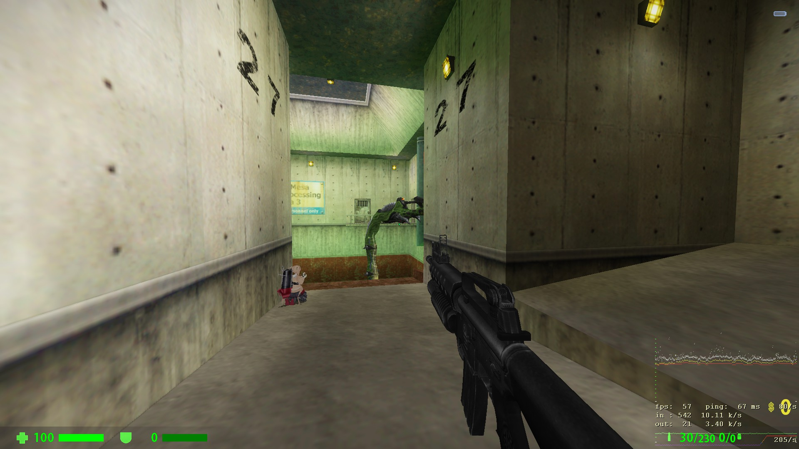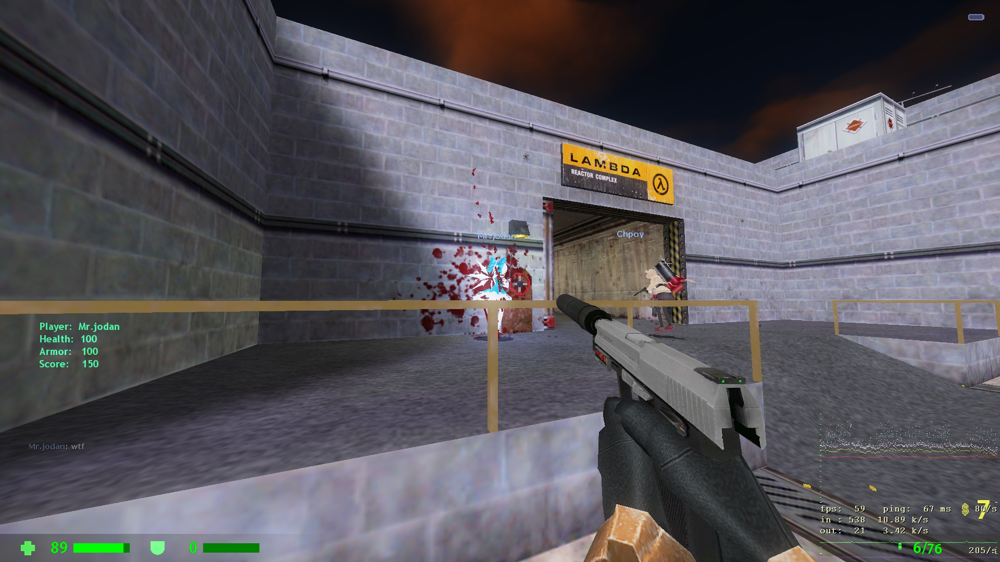</div>|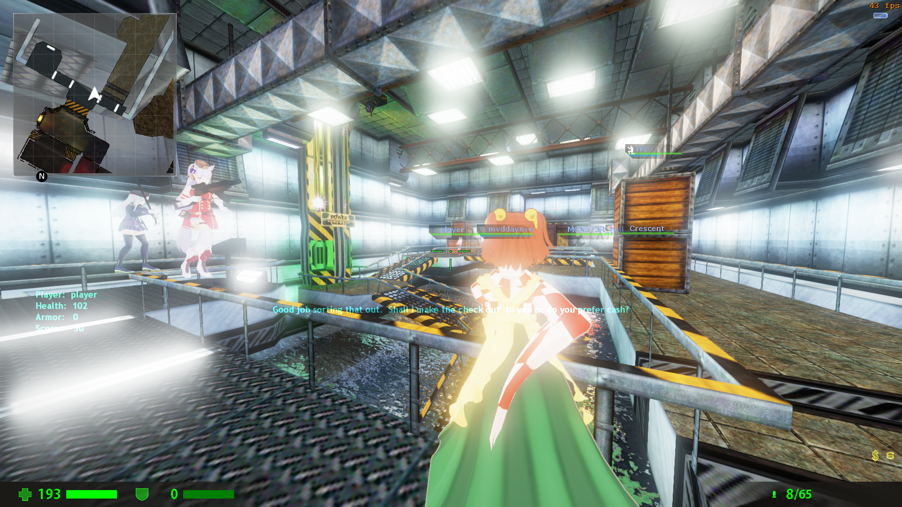|

|🛒 增强购买菜单（需要服务器支持）|🔺 动态伤害指示器|
|--|--|
|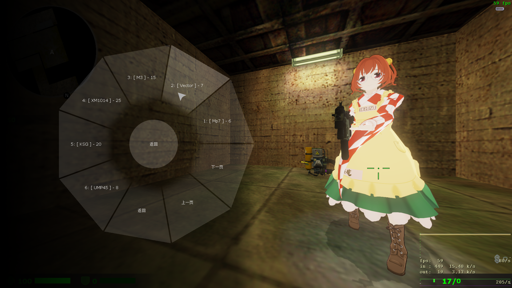|<div>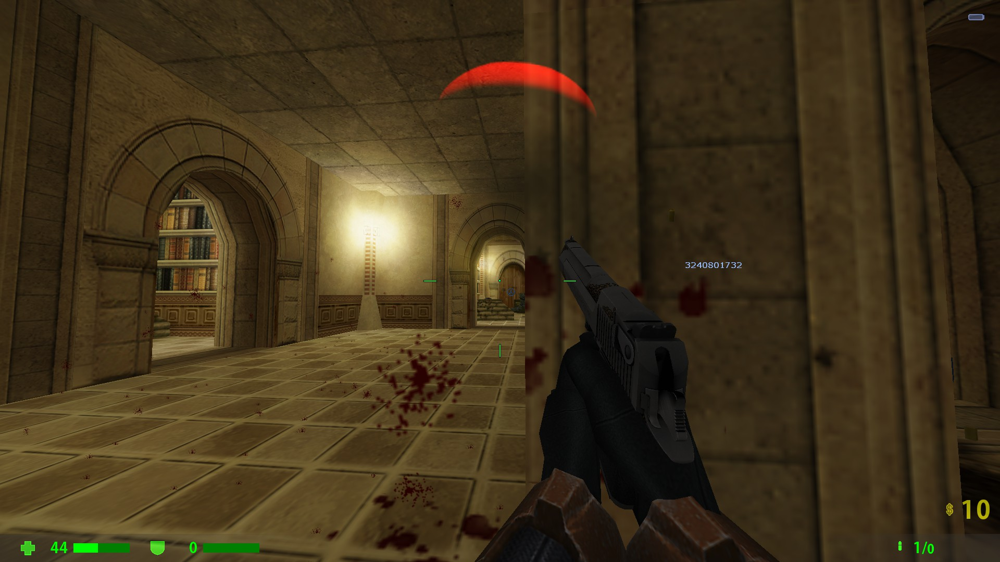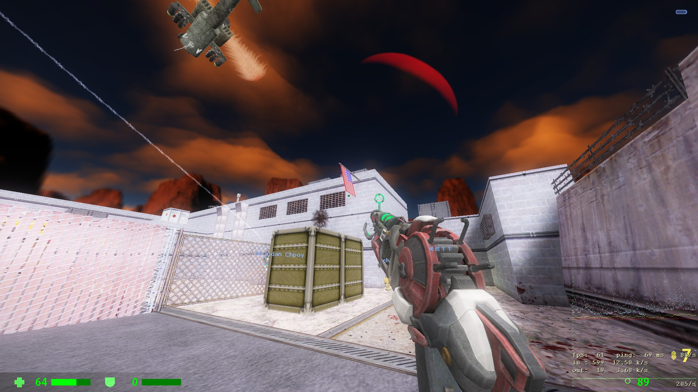</div>|

|🗺️ 雷达|🗳️ 不会恶心你的投票菜单|
|--|--|
|<div>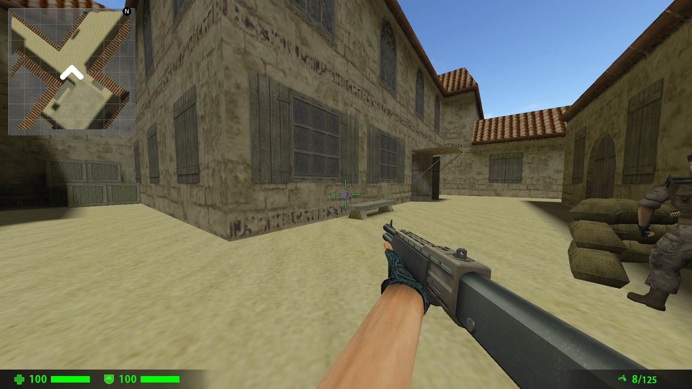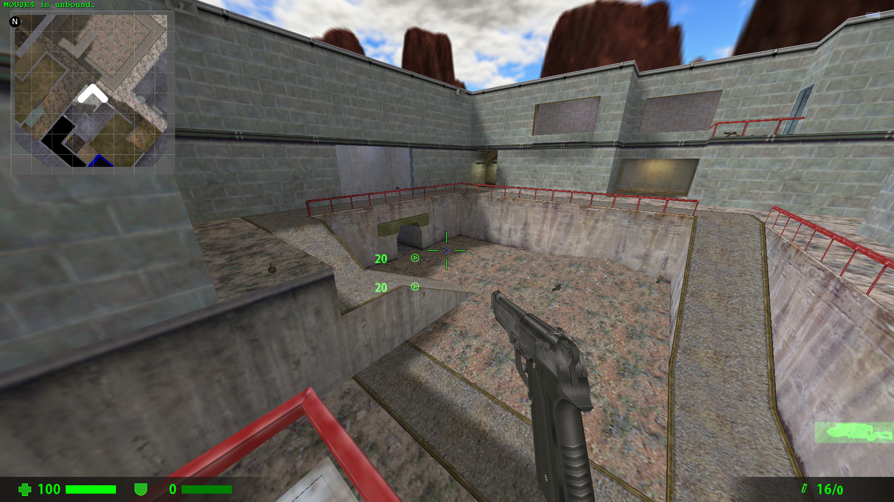</div>|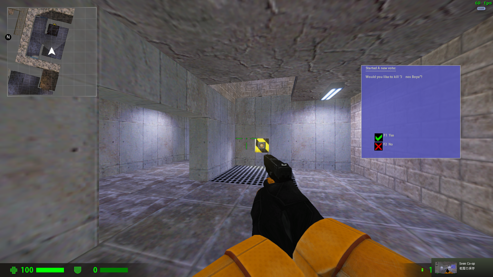|

|💀 死亡消息|☢️ 黑山起源样的高斯光线|
|--|--|
|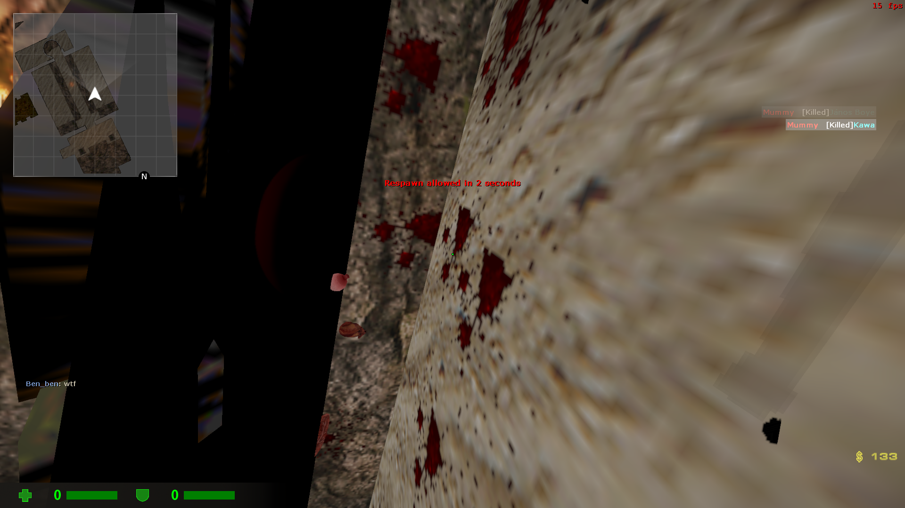|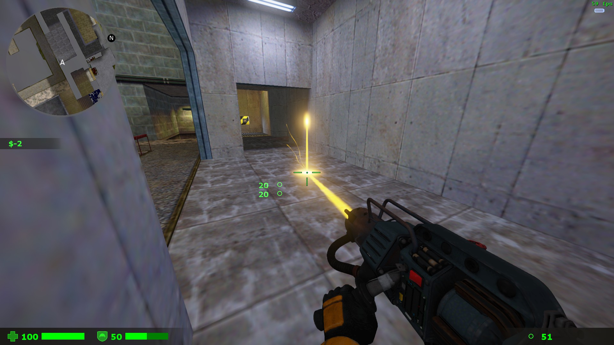|

|🪔 高光|😗 没用的efx特效|
|--|--|
|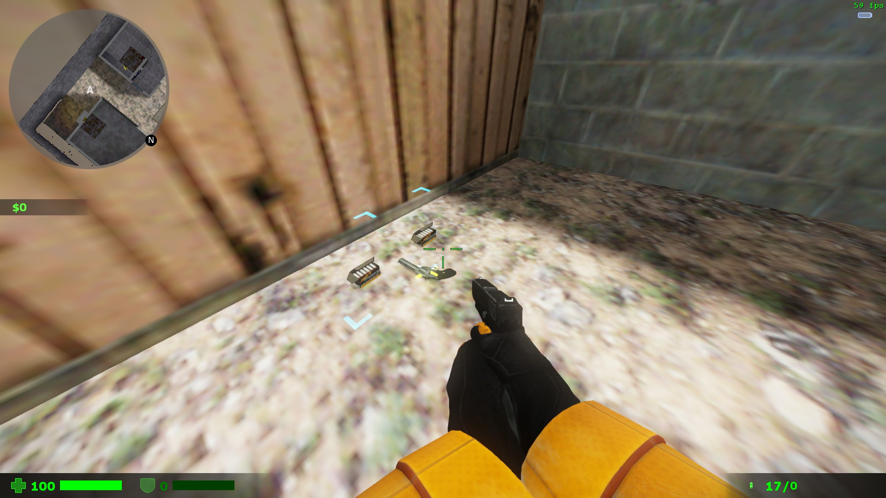|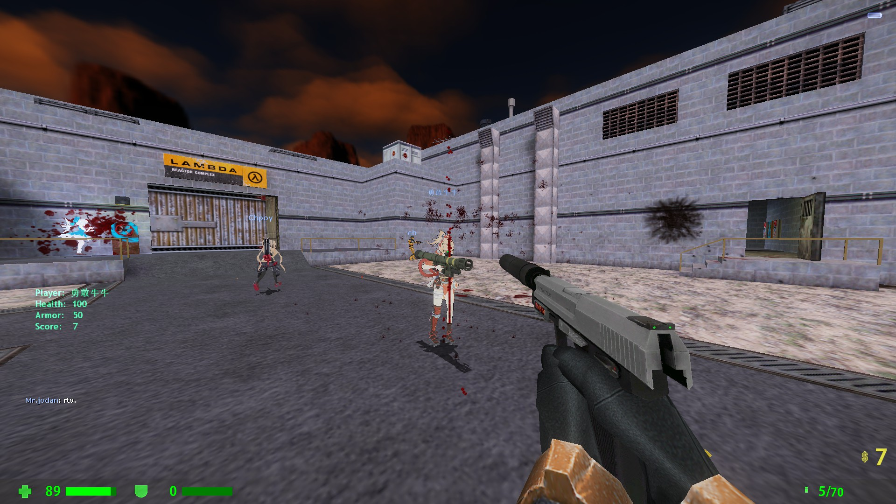|