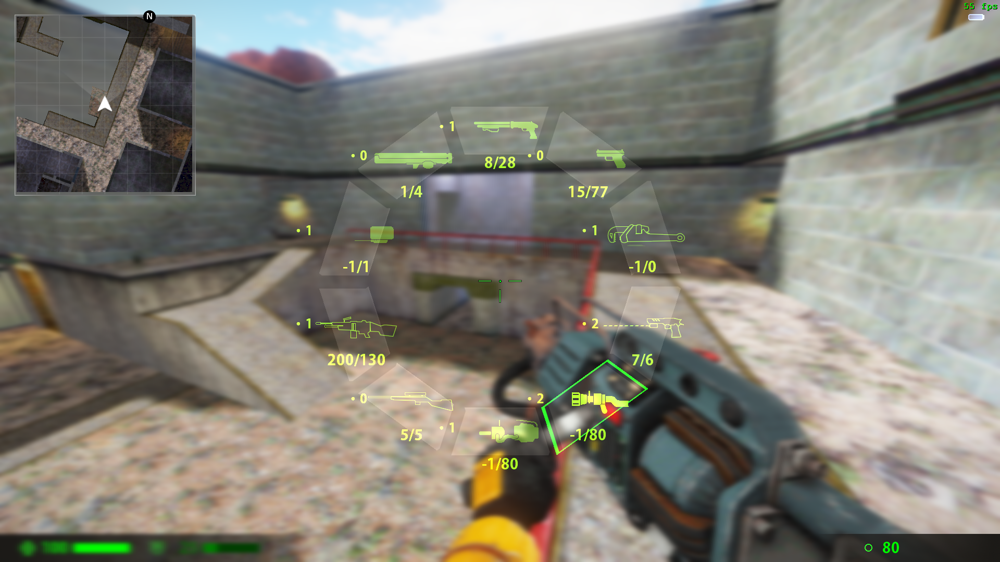
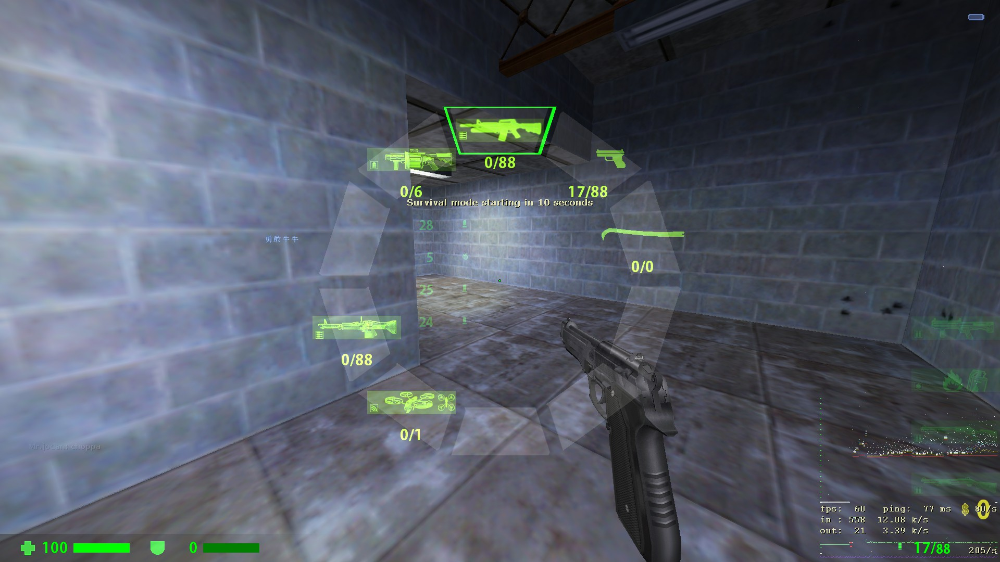
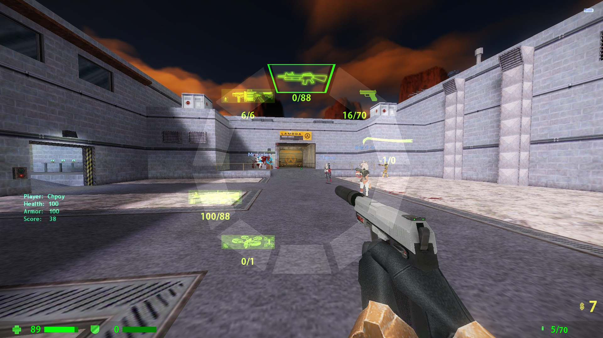
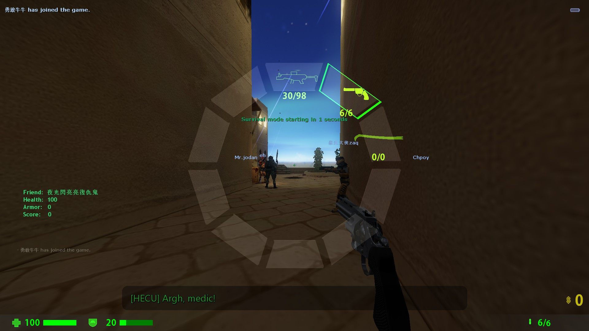

# 🔤 **ABCEnchance**

###  ABCEnchance 是一个旨在提升Sven coop游玩体验并加入更多(花里胡哨)功能的metahook插件

----

# ⚠️ **该插件正在开发，并不稳定，可能会有较大的修改** ⚠️
# 💥 **使用该插件风险自行承担** 💥

----

# 🤫 已知问题

 - [ ] 双持UZI不能正确显示第二把枪的子弹数
 - [ ] 武器Position冲突修复不能正常工作
 - [x] ~~当`+annularmenu`命令绑定到`mouse4`，`mouse5`（鼠标侧键）时，不会自动触发 `-annularmenu`命令~~

# 🖥️ 安装
 1. 下载并依照指示安装 [MetahookSV](https://github.com/hzqst/MetaHookSv)
 2. 下载`Build`文件夹, 并把 `abcenchance` 文件夹放入 `svencoop` 文件夹内, 把 `ABCEnchance.dll` 文件放入 `svencoop/metahook/plugins` 内.
 3. 用记事本或其他工具打开 `svencoop/metahook/configs/plugins.lst`文件，新建一行添加 `ABCEnchance.dll`
 4. 用记事本或其他工具依照个人喜好编辑 `svencoop/abcenchance/ABCEnchance.res` 文件

# 🏗️ 构建
 1. 克隆或下载 [MetahookSV](https://github.com/hzqst/MetaHookSv)
 2. 克隆或下载本储存库
 3. 复制 `ABCEnchance-master` 文件夹放入 `MetaHookSv-master/Plugins`
 4. 依照`MetahookSV`指示构建`glew`或`glew-debug`
 5. 构建本储存库
 
 ----

# 📤 指令
|指令|作用|
|----|----|
|+annularmenu|打开鼠标选枪环形菜单|
|-annularmenu|关闭鼠标选枪环形菜单|
|+scaleradar|开始放大雷达地图|
|-scaleradar|停止放大雷达地图|
# 📊 CVars
|CVar|作用|默认值|取值范围|
|---|---|---|---|
|cl_hud_csgo|启用HUD（重启游戏生效）|1|0/1|
|---|---|---|---|
|cl_customslot1|设置自定义轮盘 1| |weapon_xxxxx|
|cl_customslot2|设置自定义轮盘 2| |weapon_xxxxx|
|cl_customslot3|设置自定义轮盘 3| |weapon_xxxxx|
|cl_customslot4|设置自定义轮盘 4| |weapon_xxxxx|
|cl_customslot5|设置自定义轮盘 5| |weapon_xxxxx|
|cl_customslot6|设置自定义轮盘 6| |weapon_xxxxx|
|cl_customslot7|设置自定义轮盘 7| |weapon_xxxxx|
|cl_customslot8|设置自定义轮盘 8| |weapon_xxxxx|
|cl_customslot9|设置自定义轮盘 9| |weapon_xxxxx|
|cl_customslot10|设置自定义轮盘 10| |weapon_xxxxx|
|---|---|---|---|
|hud_deathnotice_time|死亡提示保持时间|6|0~9999|
|---|---|---|---|
|cl_radar|启用雷达|1|0/1|
|cl_radarzoom|雷达缩放倍数|2.5|0.0001~9999|
|cl_radarsize|雷达绘制尺寸|344|0-9999|
|cl_radarsizetime|雷达放大动画时间|0.25|0~9999|
|cl_radargap|雷达大小|0.98|0-1|
|cl_radarupdateint|雷达更新频率（秒）|1|0-9999|
|---|---|---|---|
|cl_playertitle|展示玩家状态栏|1|0/1/2|
|cl_playertitleheight|玩家状态栏高度|48|0~9999|
|cl_playertitlelength|玩家状态栏长度|196|0~9999|
|---|---|---|---|
|cl_crosshair|绘制动态准心|1|0/1|
|cl_crosshairautohide|开镜自动隐藏动态准心|1|0/1|
|cl_crosshairsize|尺寸|24|0-999|
|cl_crosshairthickness|粗细|2|0-999|
|cl_crosshairgap|距中心点间隔|16|0-999|
|cl_crosshairmultiple|后坐力扩散倍数|3|0-999|
|cl_crosshairalpha|透明度|200|0-255|
|cl_crosshaircolor_r|R|50|0-255|
|cl_crosshaircolor_g|G|250|255|
|cl_crosshaircolor_b|B|50|50|
|cl_crosshair_outline_draw|绘制描边|1|0/1|
|cl_crosshair_outline|描边粗细|1|0-999|
|cl_crosshair_t|T形准心|0|0/1|
|cl_crosshairdot|绘制中心点|0|0/1|
|---|---|---|---|
|abc_bloodsprite_speed|Efx血迹速度|128|0-9999|
|abc_bloodsprite_num|Efx新生成血迹数量|32|0-9999|
|abc_explosion_smokenumr|Efx爆炸烟雾数量|32|0-9999|
|abc_explosion_smokespeed|Efx爆炸烟雾消失速度|256|0-9999|
|abc_ricochet_sparknum|Efx击中墙壁火花数量(暂未实现)|24|0-9999|
|---|---|---|---|
|cl_modellag|启用V模型延迟|1|0/1|
|cl_modellagvalue|V模型延迟数值|1.0|0-9999|
|---|---|---|---|
|cam_idealheight|第三人称摄像机高度|0|-9999-9999|
|---|---|---|---|
|cl_curdebug|Curweapon Debug|0|0/1|

----

# 🖼️ 截图

### 🛑 <u>这些截图来自插件的不同版本，可能与现行版本有较大差距</u> 🛑

## 👮 CSGO式样HUD

## 🗿 玩家名称和血条护甲浮动标签

## 🏐 环形选枪菜单

### ~~并且修复了SC的Position冲突导致无法患处武器问题~~

## 🔺 动态伤害指示器与动态准心

## 🗺️ 雷达地图

## 🗳️ 不会在你连跳时候蹦出来打断你的投票菜单

## 💀 玩家死亡消息

## 😗 与及一些没卵用的Efx特效

